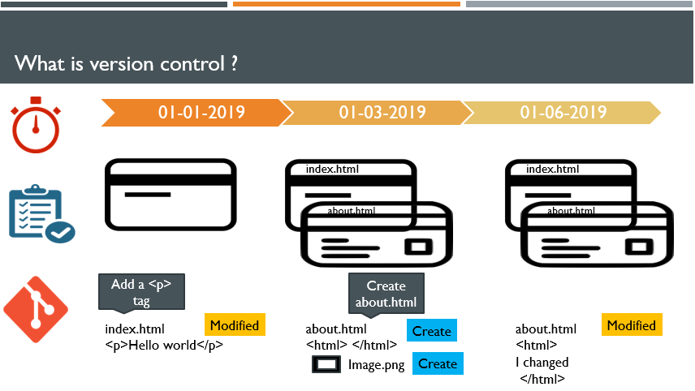

Trước khi đi tới khái niệm "Version control" chúng ta cùng xem qua 1 ví dụ: 
- Nam và An rủ nhau chơi cờ vua, khi đag chơi rất vui vẻ thì mẹ Nam gọi về chở mẹ đi chợ, ván cờ tạm thời phải dừng lại. Nam hẹn An lát quay lại chơi tiếp. Trước lúc ra về Nam đã dùng điện thoại chụp hình lại vị trí của các quân cờ trên bàn cờ vua. Một lát sau Nam quay lại để chơi tiếp thì các quân cờ trên bàn đã bị đổ và thay đổi vị trí vì con cún nhà An đi qua vô tình đã đụng trúng chân bàn. Nhưng thật may mắn vì Nam đã chụp hình vị trí các quân cờ trước khi ra về, giờ Nam và An chỉ cần xếp lại các quaan cờ theo đúng vị trí trong ảnh chụp là có thể chơi tiếp.
(Note source: https://learn.udacity.com/courses/ud123/lessons/7bd0330e-63be-40c8-acab-e7b8564fef1e/concepts/7898f6c5-17e8-4706-8996-b601d5ebf4c5)

==> Ý tưởng về việc lưu lại vị trí của các quân cờ bằng cách chụp ảnh hay ghi lại trên giấy vị trí các quân cờ chính xác là việc mà quản lý phiên bản đang làm.

- Vậy Version control (quản lý phiên bản) là gì?

  - Version control, hay được biết đến với tên gọi khác là source control, là một thuật ngữ kỹ thuật có nghĩa là Quản lý phiên bản. 

  - Mục đích của quản lý phiên bản là cho phép các nhóm phần mềm theo dõi các thay đổi đối với mã nguồn, quản lý sự thay đổi của toàn bộ dự án (tiêu biểu là source code, file hình ảnh,...).

  - Version control, bạn có thể tạo ra nhiều phiên bản của các file ứng với thay đổi mà bạn tạo ra, tạo điều kiện cho việc phát triển phần mềm một cách liên tục, đơn giản.

Version Control System Diagram - Nguồn: Kipalog

- Giả sử chúng sử dụng version control để quản lý code cho dự án làm 1 website như ở hình trên, version control sẽ cho phép chúng ta theo dõi sự thay đổi của các file theo thời gian, tạo ra các phiên bản khác nhau của dự án ứng với từng thay đổi.

#### Version control systems
- Là các công cụ phần mềm giúp quản lý các thay đổi đối với mã nguồn theo thời gian.

- Có rất nhiều hệ thống quản lý phiên bản (see more: https://en.wikipedia.org/wiki/List_of_version-control_software), qua đây cũng thấy mức độ quan trọng của việc quản lý phiên bản.
Có 3 hệ thống quản lý phiên bản tiêu biểu nhất là: Git, Subversion và Mercurial. Chúng được chia làm 2 loại khác nhau: Centralized và Distributed.

- The Centralized Version Control Systems(CVCS): tất cả người dùng sẽ kết nối tới 1 server duy nhất (Central Repository), tất cả các thành viên tham gia dự án có thể lấy code về, chỉnh sửa, sau đó đẩy code trở lại server. VCS tập trung cũng có hạn chế, nếu không may xảy ra sự cố, mà các sao lưu dự phòng chưa được tạo ra tính đến thời điểm đó, bạn sẽ mất toàn bộ lịch sử của dự án đó, ngoại trừ những phiên bản cục bộ mà người dùng có được trên máy tính cá nhân. Server bị dừng thì không thể kết nối để các thành viên làm việc.

- The Distributed Version Control Systems(DVCS): Khắc phục nhược điểm của VCS thì một loại VCS nữa được đề xuất đó là Distributed Version Control Systems (DVCS) hay Hệ thống quản lý phiên bản phân tán. Nó giống với CVCS là có một máy chủ, ở đó có Database lưu giữ các phiên bản của file, tuy nhiên khác biệt đó là các máy client (các developer) kết nối vào thì nó không chỉ lấy file mà nó lấy luôn cả hệ thống Database. Điều này có nghĩa là khi Server bị ngắt hoặc không có mạng, các máy client vẫn làm việc bình thường trên Database ở máy trạm, sau đó commit và push lên Server sau, hoặc Database ở Server bị lỗi thì bất kỳ máy client nào đều có thể phục hồi lại cho Server.

Git Distributed Version control model - Nguồn: https://www.earthdatascience.org/

- Sau khi đã sử dụng Git vậy các bạn nghĩ Git thuộc loại nào: CVCS hay DVCS?

==> Git chính là hệ thống quản lý phiên bản phân tán (DVCS), với các ưu điểm: tốc độ, đơn giản, phân tán, phù hợp với dự án lớn nhỏ.

- Cách lưu dữ liệu của Git
Git lưu dữ liệu dưới dạng một loạt "ảnh chụp" (snapshot) của một tập hợp các file, có nghĩa là mỗi khi bạn commit (lưu lại) thì Git tiến hành chụp lại hệ thống các file thời điểm đó và lưu giữ một tham chiếu đến ảnh chụp dó, nhớ rằng các file không có thay đổi thì Git sẽ không lưu lại file đó lần nữa mà chỉ có một liên kết đến file đã lưu ở lần trước.

- Thao tác file với Git
Hầu hết mọi thao tác với Git diễn ra ở Local. Vì mỗi máy trạm có một Database Git nên hầu hết thao tác với Git như thêm mới, xem lại lịch sử ... đều không cần đến Server (trừ khi cần commit lên Server, hay lấy về một file do người khác đã cập nhật).