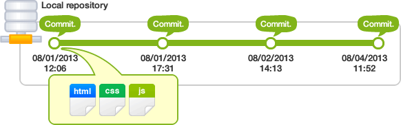
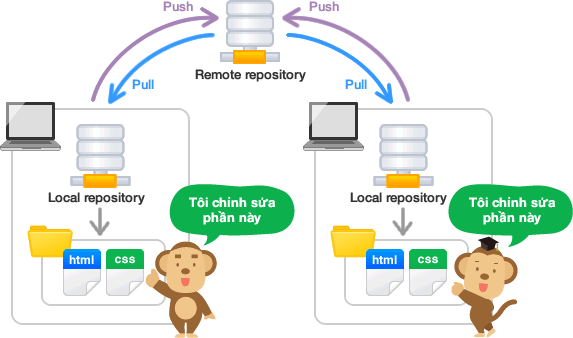

### 1. Version Control System / Source Code Manager
Version control systems (viết tắt là: VCS) là công cụ để quản lý sự thay đổi của source code. A source code manager (viết tắt là SCM) là tên gọi khác của  version control system.
- https://git-scm.com/

### 2. Commit
- Commit là thao tác báo cho hệ thống biết bạn muốn lưu lại trạng thái hiện hành, ghi nhận lại lịch sử các xử lý như thêm, xóa, cập nhật các file hay thư mục nào đó trên repository. Khi đó Git sẽ tạo 1 snapshot ghi lại thay đổi hiển tại của dự án và lưu giữ 1 tham chiếu đến ảnh chụp đó. Lúc này trong repository sẽ ghi lại sự khác biệt từ lần commit trước đó với trạng thái hiện tại. Các commit ghi nối tiếp với nhau theo thứ tự thời gian do đó chỉ cần theo vết các commit thì có thể biết được lịch sử thay đổi trong quá khứ.
- Mỗi commit đều yêu cầu nhập nội dung commit (nếu lần đầu chưa cấu hình emmail và username người commit, Git sẽ yêu cầu cài đặt trước khi commit) do vậy khi kiểm tra lại lịch sử có thể biết được nội dung, thời gian, thông tin người commit.
- Mỗi commit sẽ có 1 ID: Git sử dũng mã hash SHA-1, mỗi chuỗi hash SHA-1 sinh ra căn cứ theo nội dung của file dài 40 ký tự (tạo ra từ các ký tự trong khoảng thập lục phân : 0-9, a-f) có dạng:
62FC2DBFB0CB299DD8548286FE1BB1D2B2041379

Commit Hisory - Nguồn: https://backlog.com/git-tutorial/vn

### 3. Repository/Repo
- Repository là nơi sẽ ghi lại trạng thái của thư mục và file. Trạng thái được lưu lại đang được chứa như là lịch sử thay đổi của nội dung. Bằng việc đặt thư mục muốn quản lý lịch sử thay đổi dưới sự quản lý của repository, có thể ghi chép lại lịch sử thay đổi của thư mục và file trong thư mục đó.

- Repository của Git được chia làm 2 loại:
    - Remote repository: Là repository để chia sẻ giữa nhiều người và bố trí trên server (Github, Gitlab, Bitbucket,...)
    - Local repository: Là repository bố trí trên máy cá nhân (client) dành cho cá nhân sử dụng

- Do repository phân thành 2 loại là local và remote nên với những công việc bình thường thì có thể sử dụng local repository. Khi muốn cập nhật nội dung công việc mà bản thân đã làm trên local repository, thì sẽ upload (push) lên remote repository. Thêm nữa, thông qua remote repository cũng có thể lấy về nội dung công việc của người khác.

Repository - Nguồn: https://backlog.com/git-tutorial/vn

- Tạo repository
Có 2 cách tạo local repository
    - Tạo repository hoàn toàn mới
    - Sao chép remote repository rồi tạo

### 4. Git workflow
- Gồm 3 thành phần chính
    - Working directory
    - Staging Area
    - Local Repository

### 5. Checkout
- A checkout is when content in the repository has been copied to the Working Directory.

### 6. Staging Area/ Staging Index/ Index
- A file in the Git directory that stores information about what will go into your next commit. You can think of the staging area as a prep table where Git will take the next commit. Files on the Staging Index are poised to be added to the repository.

It is a 40-character string composed of characters (0–9 and a–f) and calculated based on the contents of a file or directory structure in Git. "SHA" is shorthand for "Secure Hash Algorithm". If you're interested in learning about hashes, check out our Intro to Computer Science course.

### 8. Branch
- A branch is when a new line of development is created that diverges from the main line of development. This alternative line of development can continue without altering the main line.