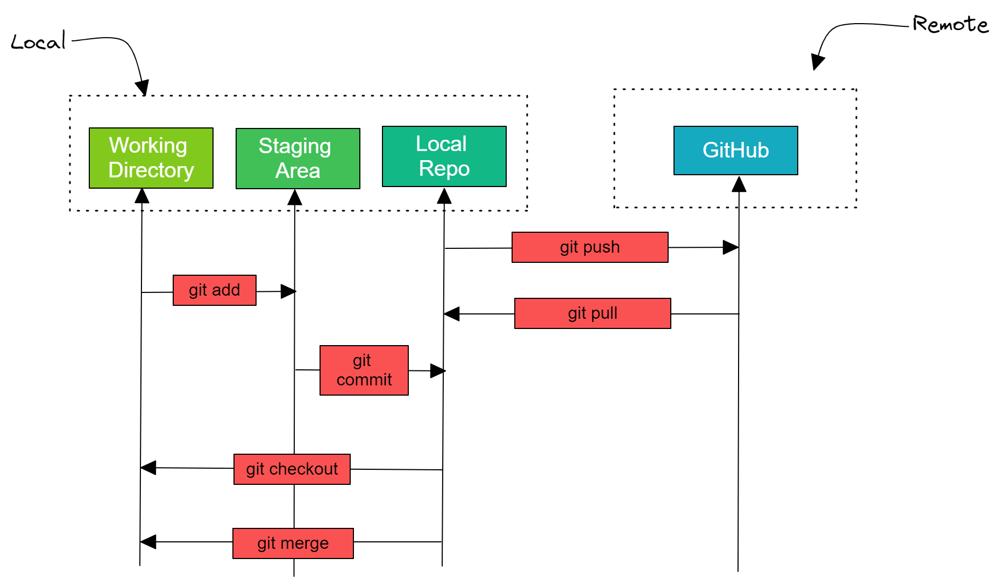

### 1. Version Control System / Source Code Manager
Version control systems (viết tắt là: VCS) là công cụ để quản lý sự thay đổi của source code. A source code manager (viết tắt là SCM) là tên gọi khác của  version control system.
- https://git-scm.com/

### 2. Commit
- Commit là thao tác báo cho hệ thống biết bạn muốn lưu lại trạng thái hiện hành, ghi nhận lại lịch sử các xử lý như thêm, xóa, cập nhật các file hay thư mục nào đó trên repository. Khi đó Git sẽ tạo 1 snapshot ghi lại thay đổi hiển tại của dự án và lưu giữ 1 tham chiếu đến ảnh chụp đó. Lúc này trong repository sẽ ghi lại sự khác biệt từ lần commit trước đó với trạng thái hiện tại. Các commit ghi nối tiếp với nhau theo thứ tự thời gian do đó chỉ cần theo vết các commit thì có thể biết được lịch sử thay đổi trong quá khứ.

Commit Hisory - Nguồn: https://backlog.com/git-tutorial/vn

- Mỗi commit đều yêu cầu nhập nội dung commit (nếu lần đầu chưa cấu hình emmail và username người commit, Git sẽ yêu cầu cài đặt trước khi commit) do vậy khi kiểm tra lại lịch sử có thể biết được nội dung, thời gian, thông tin người commit.
- Mỗi commit sẽ có 1 ID: Git sử dũng mã hash SHA-1, mỗi chuỗi hash SHA-1 sinh ra căn cứ theo nội dung của file dài 40 ký tự (tạo ra từ các ký tự trong khoảng thập lục phân : 0-9, a-f) có dạng:
62FC2DBFB0CB299DD8548286FE1BB1D2B2041379

### 3. Repository/Repo
- Repository là nơi sẽ ghi lại trạng thái của thư mục và file. Trạng thái được lưu lại đang được chứa như là lịch sử thay đổi của nội dung. Bằng việc đặt thư mục muốn quản lý lịch sử thay đổi dưới sự quản lý của repository, có thể ghi chép lại lịch sử thay đổi của thư mục và file trong thư mục đó.

- Repository của Git được chia làm 2 loại:
    - Remote repository: Là repository để chia sẻ giữa nhiều người và bố trí trên server (Github, Gitlab, Bitbucket,...)
    - Local repository: Là repository bố trí trên máy cá nhân (client) dành cho cá nhân sử dụng

- Do repository phân thành 2 loại là local và remote nên với những công việc bình thường thì có thể sử dụng local repository. Khi muốn cập nhật nội dung công việc mà bản thân đã làm trên local repository, thì sẽ upload (push) lên remote repository. Thêm nữa, thông qua remote repository cũng có thể lấy về nội dung công việc của người khác.


Repository - Nguồn: https://backlog.com/git-tutorial/vn

- Tạo repository
Có 2 cách tạo local repository
    - Tạo repository hoàn toàn mới
    - Sao chép remote repository rồi tạo

### 4. Ghi lại thay đổi vào repository
- Trong git có 3 khu vực đảm nhận việc ghi lại thay đổi vào repo
    - Working directory (Working tree)
    - Staging Area
    - Local Repository


Ghi lại thay đổi vào repository - Nguồn: https://www.earthdatascience.org/

### 4.1 Working directory
- Working directory (Working tree) là khu vực chứa các thư mục, file mà bạn đang làm việc trong thực tế và được đặt dưới sự quản lý của Git (thư mục đã được chuyển đổi thành kho lưu trữ Git - chứa .git)

### 4.2 Staging Area / Staging index/ Index
- Khu vực lưu trữ các files chuẩn bị cho commit. Các file cần được đăng ký vào trong Staging Area trước khi commit. 
- Với việc chèn Staging Area vào giữa như thế này, có thể thực hiện commit chỉ những file cần thiết(những file có trong Working Tree nhưng không có trong Staging Area), hay có thể đăng ký chỉ một phần thay đổi của file trong index rồi commit.
- Để di chuyển 1 file từ Working Directory vào Staging Index chúng ta sử dụng lệnh.

```yml
# command is used to move files from the Working Directory to the Staging Index

$ git add
```

### 4.3 Local Repository
- Nơi sẽ ghi lại trạng thái của thư mục và file. Trạng thái được lưu lại đang được chứa như là lịch sử thay đổi của nội dung.

### 5. Branch
- Branches là một phần quan trọng khi làm việc với Git. Vì bất kỳ 1 commit nào cũng sẽ được thực hiện trên 1 branch cụ thể (eg: main, develop, release...). Use `git status` để biết bạn đag ở nhánh nào.

#### Kiểm tra phiên bản GIT
git --version

#### Danh sách các thiết lập cấu hình
git config --list

#### Thiết lập tên
git config --global user.name "Tên của Bạn"

#### Thiết lập email
git config --global user.email emailcuaban@domain.com