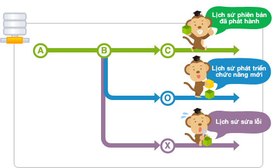
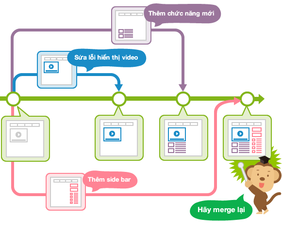
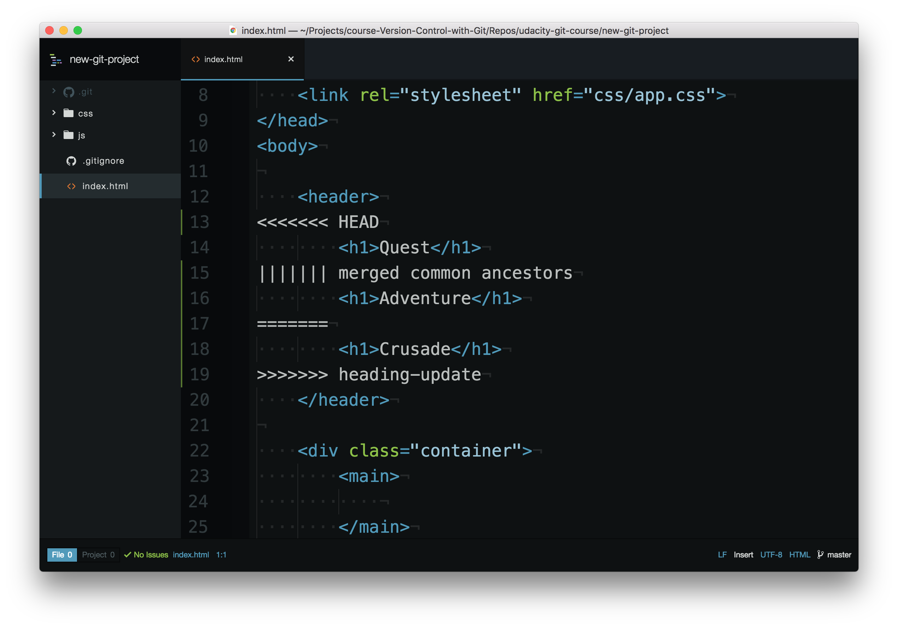

### 4.4 Tagging, Branching, and Merging

#### 4.4.1 Tagging
- Tag là chức năng đặt tên một cách dễ hiểu để có thể dễ dàng tham chiếu commit.

- Trên Git có thể sử dụng 2 loại tag là lightweigh tag và annotated tag. 
    - Lightweigh tag
        - Temporary tag là cái không thể thay đổi
        - Có thể đặt tên

    - Annotated tag
        - Có thể đính kèm tên và email của người thực hiện và ngày
        - Có thể đặt tên
        - Có thể đính kèm bình luận
        - Có thể đính kèm chữ ký

- Annotated tag sẽ trở nên quan trọng khi có kế hoạch đánh dấu commit quan trọng. Thông thường dùng để đánh dấu commit dùng để release và cũng có thể thêm những chú thích bên cạnh.

- Mặt khác lightweigh tag thì chủ yếu được dùng trên không gian local làm việc tạm thời.

> Chúng ta sẽ tập trung vào annotated tag bởi vì nó bổ sung nhiều thông tin trong mỗi tag: người tạo tag, ngày tạo tag, nội dung tag.

- Thêm tag
    - Thêm lightweight tag

    ```yml
    $ git tag <tagname>
    ```

    - Thêm annotated tag

    ```yml
    $ git tag -a <tagname>

    # Vừa muốn tạo tag vừa thêm bình luận

    $ git tag -am "Hướng dẫn về Git cho người mới bắt đầu" banana
    ```

- Sau khi tạo tag xong, git sẽ không thông báo cho chúng ta về việc đã tạo tag hoàn thành.
- Để check thông tin tất cả các tag chúng ta dùng lệnh `git tag`


- Xóa tag

```yml
$ git tag -d <tagname>
```

- Khi dùng lệnh `git tag -a v1.0` như trên mặc định sẽ tạo tag cho commit mới nhất hiện tại của chúng ra. Do vậy để tạo 1 tag gắn với 1 commit đã commit trước đó chúng ta có thể thêm SHA của commit mà chúng ta muốn tạo tag

`git tag -a v1.0 a87984`


#### 4.4.2 Branching
- Branches là một phần quan trọng khi làm việc với Git. Vì bất kỳ 1 commit nào cũng sẽ được thực hiện trên 1 branch cụ thể (eg: main, develop, release...). Use `git status` để biết bạn đag ở nhánh nào.

- Branch dùng để phân nhánh do vậy khi thực hiện những thay đổi trên 1 branch sẽ không ảnh hưởng đến branch khác nên có thể tiến hành nhiều thay đổi đồng thời trong cùng 1 repository. Hơn nữa sau đó có thể hợp lại (merge) với các branch khác.


Branch - Nguồn: https://backlog.com/git-tutorial/vn


Branch - Nguồn: https://backlog.com/git-tutorial/vn

- Một số lệnh
    - git branch: được sử dụng để tương tác với các nhánh của Git

        - Hiển thị list branch hiện tại, nhánh nào có dấu * phía trước tên nhánh là nhánh đag active.
            ```yml
                $ git branch
            ```

        - Tạo 1 branch
            ```yml
            $ git branch <name_branch>
            ```
        
        - Tạo 1 nhánh và checkout sag nhánh đó
            ```yml
            $ git checkout -b <name_branch>
            ```

        - Xóa 1 branch: (Note: Không thể delete nhánh mà hiện tại bạn đag trỏ tới)
            ```yml
            $ git branch -d <name-branch>
            ```

    - git checkout: Dùng để chuyển đổi giữa các nhánh, cũng có thể dùng để tạo 1 branch.
            ```yml
            $ git checkout <name_branch>
            ```
    

#### 4.4.3 Merging
- Merge là kết hợp (gộp) nhiều nhánh với nhau.

- Git có thể tự động hợp nhất các thay đổi trên các nhánh khác nhau với nhau. Khả năng phân nhánh và hợp nhất này là điều làm cho Git trở nên cực kỳ mạnh mẽ! Bạn có thể thực hiện các thay đổi nhỏ hoặc mở rộng trên các nhánh, sau đó chỉ cần sử dụng Git để kết hợp các thay đổi đó với nhau.

- Hãy nhớ rằng thực hiện merge cũng có nghĩa là bạn đag thực hiện 1 commit.

```yml
$ git merge <name-of-branch-to-merge-in>
```

- Khi hợp nhất xảy ra, Git sẽ: 
    - Nhìn vào các nhánh mà nó sẽ hợp nhất 
    - Nhìn lại lịch sử của chi nhánh để tìm một cam kết duy nhất mà cả hai chi nhánh đều có trong lịch sử cam kết của nó.
    - Kết hợp các dòng mã đã được thay đổi trên các nhánh riêng biệt với nhau 
    - Thực hiện một cam kết để ghi lại sự hợp nhất

- Có 2 loại merge:
    - Fast-forward Merge: 
        - nhánh được sáp nhập phải đi trước nhánh đã kiểm tra. Con trỏ của nhánh đã kiểm tra sẽ được chuyển về phía trước để trỏ đến cùng một cam kết với nhánh kia.

    - Perform A Regular Merge:
       - two divergent branches are combined
       - a merge commit is created

#### 4.4.3.1 Merge conflict
- Hầu hết Git có thể hợp nhất các nhánh với nhau mà không có vấn đề gì. Tuy nhiên, có những trường hợp hợp nhất không thể được thực hiện hoàn toàn tự động. Khi hợp nhất không thành công, nó được gọi là xung đột hợp nhất - `merge conflict`.

- Nếu `merge conflict` xảy ra, Git sẽ cố gắng kết hợp các thay đổi nhiều nhất có thể, nhưng sau đó nó sẽ để lại các điểm đánh dấu đặc biệt (ví dụ: `>>>` và `<<<`) cho bạn biết nơi bạn cần sửa để quá trình merge được hoàn tất.

- Nguyên nhân nào gây ra xung đột hợp nhất?
    - Như bạn đã biết, Git theo dõi các dòng trong tệp. Xung đột hợp nhất sẽ xảy ra khi (các) dòng giống hệt nhau được thay đổi trong các nhánh riêng biệt. Lúc này Git không biết bạn muốn giữ lại sự thay đổi nào, do vậy bạn cần nói cho Git biết bạn muốn giữ lại thay đổi nào, thay đổi nào cần được xóa (quá trình bạn sửa conflict).

- Thông báo lỗi trong terminal khi bị merge conflict

```yml
$ git merge heading-update 
Auto-merging index.html
CONFLICT (content): Merge conflict in index.html
Automatic merge failed; fix conflicts and then commit the result.
```


Merge conflict indicators - Nguồn: https://learn.udacity.com/

- Trình chỉnh sửa có các chỉ báo xung đột hợp nhất sau:
    - `<<<<<<< HEAD` mọi thứ bên dưới dòng này (cho đến khi chỉ báo tiếp theo) hiển thị cho bạn những gì trên nhánh hiện tại
    - `||||||| merged common ancestors` mọi thứ bên dưới dòng này (cho đến khi indicator tiếp theo) cho bạn biết các dòng ban đầu là gì
    - `=======` là phần cuối của các dòng ban đầu, mọi thứ tiếp theo (cho đến indicator tiếp theo) là những gì trên nhánh đang được hợp nhất.
    - `>>>>>>> heading-update` là kết thúc indicator của những gì trên nhánh đang được hợp nhất (trong trường hợp này là nhánh `heading-update`)

- Resolving A Merge Conflict:
    - Git đang sử dụng các indicator báo xung đột hợp nhất để cho bạn biết dòng nào đã gây ra xung đột hợp nhất trên hai nhánh khác nhau cũng như dòng ban đầu từng có. Vì vậy, để giải quyết xung đột hợp nhất, bạn cần:
        - chọn (các) dòng để giữ lại
        - loại bỏ tất cả các dòng mà đag được đánh dấu

- Commit merge conflict:
    - Khi bạn đã xóa tất cả các dòng có indicator xung đột hợp nhất và chọn dòng bạn muốn giữ lại, sau đó lưu tệp, thêm tệp vào `Staging Index` và `commit`!
    - Cũng giống như `regular merge`, thao tác này sẽ mở trình chỉnh sửa mã của bạn để bạn cung cấp thông báo commit. Cũng giống như trước đây, chúng ta thường sử dụng message commit merge được cung cấp, vì vậy sau khi trình chỉnh sửa mở ra, chỉ cần đóng nó để sử dụng message commit được cung cấp.

==> Merge conflict recap
- Merge conflict xảy ra khi cùng một dòng hoặc các dòng đã được thay đổi trên các nhánh khác nhau đang được hợp nhất. Git sẽ tạm dừng giữa quá trình hợp nhất cho bạn biết rằng có xung đột và sẽ cho bạn biết xung đột đã xảy ra trong tệp nào hoặc tệp nào. Để giải quyết xung đột trong tệp:
    - xác định vị trí và loại bỏ tất cả các dòng có indicator xung đột
    - xác định những gì cần giữ
    - lưu (các) tệp
    - thêm các tệp vào Staging Index
    - thực hiện một commit

- Note:
    - Hãy cẩn thận rằng một tệp có thể có xung đột hợp nhất trong nhiều phần của tệp, vì vậy hãy đảm bảo bạn kiểm tra toàn bộ tệp để tìm các chỉ báo xung đột hợp nhất - tìm kiếm nhanh `<<<` sẽ giúp bạn xác định được tất cả chúng.